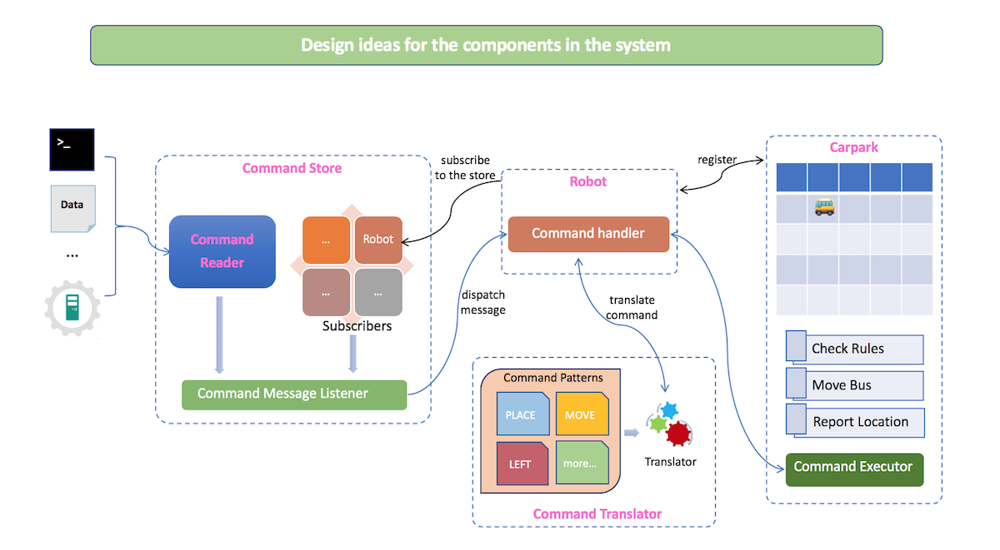

# System design document

## Components design

The system contains mainly 5 components(words in pink color on the above chart), which are Command Reader, Command Store, Robot, Command Translator, and Carpark. These components work together loosely to complete the task to move bus correctly in the carpark.

## Command Reader

This component provides an interface API to let any consumer read command from it. 

The target is quite simple, and it is independent enough for you to extend it to read data from any place you want. It may be from a command line, a data file on disk, an array from memory, or even from a remote API service.

## Command Store

This component focus on listening on Command Reader and dispatching commands received to all the subscribers.

So it contains a Command Reader registered into it and a subscriber list.

When a Command Store starts to work, it listens on the Command Reader, and loop subscribers to send each command received to every subscriber.

This pub/sub model can easily add or remove an object from the subscriber list, and no change needed if we are going to support the multi-robot case.

## Robot

A robot contains a Carpark registered to it, and it translates any command received from a Command Store to operations on Carpark with help from the Command Translator.

## Command Translator

Command Translator is a utility for Command Pattern design and command translation.

We have defined some commands like PLACE, MOVE, and REPORT in it. When a command message received by the Command Translator, it will try to match Command Patterns defined, and translate command into operations.

Within this component, we can design new Command Patterns to extend the commands scope we can do to a Carpark easily.

## Carpark

A Carpark is an object with the definition of dimensions, and all the operations we can do to it.

It will run a preliminary check on the operation received from a robot according to the rules of a Carpark, and any action goes against the rules will be ignored.

Within the Carpark component, we can easily define new rules and operations to make it extensible.
